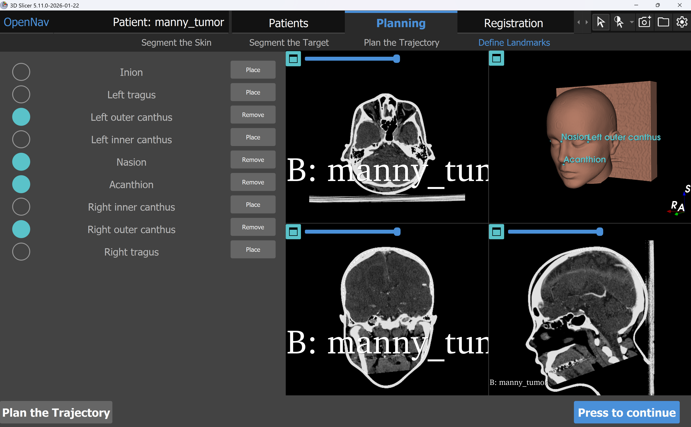

# SlicerOpenNav


Open source tools for surgical navigation built as a [3D Slicer](https://www.slicer.org/) extension.



## Overview

SlicerOpenNav (also known as OpenNav) provides a complete workflow for image-guided surgical navigation, including:

- **Patient Management**: DICOM import, case organization, and automatic session saving/loading
- **Surgical Planning**: Skin and target segmentation, trajectory planning, and anatomical landmark definition
- **Tool Calibration**: Pivot and spin calibration for tracked surgical instruments
- **Patient Registration**: Landmark-based and surface-based (ICP) registration to align patient anatomy with preoperative imaging
- **Real-time Navigation**: Live instrument tracking with multi-planar reformatted views following the pointer tip

## Features

- Guided step-by-step workflow with validation at each stage
- OptiTrack optical tracking integration via PLUS toolkit
- Automatic case saving and session recovery
- Customizable anatomical landmark selection
- Surface tracing for registration refinement
- Multiple navigation view layouts (6-up, 2-up)

## Requirements

- [3D Slicer](https://download.slicer.org/) (version 5.0 or later recommended)
- [PLUS toolkit](https://plustoolkit.github.io/) for optical tracking support
- OptiTrack camera system (or compatible tracking hardware)

### Slicer Extension Dependencies

- SlicerOpenIGTLink
- SlicerIGT

## Installation

### From Extension Manager

*(Coming soon)*

### From Source

1. Clone this repository:
   ```bash
   git clone https://github.com/NousNav/SlicerOpenNav.git
   ```

2. Build as a Slicer extension:
   ```bash
   mkdir SlicerOpenNav-build && cd SlicerOpenNav-build
   cmake -DSlicer_DIR=/path/to/Slicer-build/Slicer-build ../SlicerOpenNav
   cmake --build . --config Release
   ```

3. Or load directly in Slicer for development:
   - Open Slicer
   - Go to Edit → Application Settings → Modules
   - Add the module directories to "Additional module paths"
   - Restart Slicer

## Usage

### Workflow Overview

1. **Patients**: Load DICOM images or open an existing case
2. **Planning**:
   - Segment the skin surface
   - Segment the target anatomy
   - Define the surgical trajectory (entry and target points)
   - Place anatomical landmarks for registration
3. **Registration**:
   - Connect and position tracking hardware
   - Perform pointer pivot and spin calibration
   - Collect landmark points on the patient
   - Trace the skin surface for registration refinement
   - Verify registration accuracy
4. **Navigation**: Track instruments in real-time with image guidance

### Data Storage

Cases are automatically saved to `~/OpenNav/Cases/{case_name}/` and can be reopened from the Patients screen.

## Modules

| Module | Description |
|--------|-------------|
| Home | Main application interface and workflow orchestration |
| Patients | DICOM loading and case management |
| Planning | Segmentation and trajectory planning |
| Registration | Calibration and patient-to-image registration |
| Navigation | Real-time tracking and visualization |
| LandmarkManager | Anatomical landmark handling |
| OptiTrack | Optical tracking hardware integration |
| OpenNavUtils | Shared utilities and helpers |

## Contributing

Contributions are welcome! Please feel free to submit issues and pull requests.

## Development

### Pre-commit Hooks

This project uses [pre-commit](https://pre-commit.com/) with [ruff](https://docs.astral.sh/ruff/) for linting and formatting:

```bash
pip install pre-commit
pre-commit install
```

### Git Blame

To ignore formatting commits in git blame:

```bash
git config blame.ignoreRevsFile .git-blame-ignore-revs
```

## License

This project is licensed under the Apache License 2.0 - see the [LICENSE](LICENSE) file for details.

## Acknowledgments

- Developed by [Kitware Inc.](https://www.kitware.com/)
- Built on [3D Slicer](https://www.slicer.org/)
- Tracking integration via [PLUS toolkit](https://plustoolkit.github.io/)

## References

- [3D Slicer Documentation](https://slicer.readthedocs.io/)
- [PLUS toolkit Documentation](https://plustoolkit.github.io/documentation.html)
